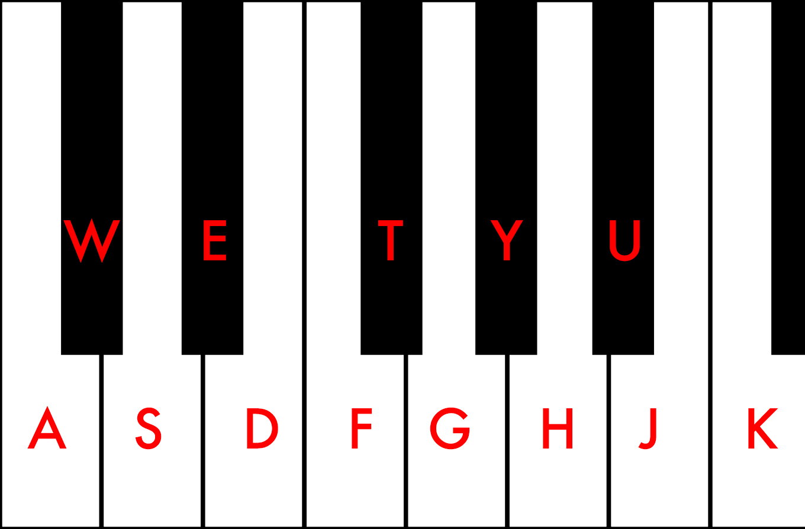

# Pure Data and Google Magenta

FA20 MUS 171 Computer Music Final Project:

Using [Pure Data](https://github.com/terryzfeng/Pure-Data-and-Google-Magenta) and [Google Magenta](https://github.com/magenta/magenta) to create music:

Goals

1. Use PD as a MIDI Controller and Receiver to initiate call and response melodies between the user and Magenta

2. Create a dialogue between Pure Data and Magenta to generate ambient textures through random data (PD) and repetition/pattern recognition (Magenta)

## Setup

1.  Set up the Google Magenta MIDI environment (full documentation [here](https://github.com/magenta/magenta/blob/master/magenta/interfaces/midi/README.md))

2.  Run a Magenta Model through the shell script (pick one)

        ./basic.sh
        ./attention.sh
        ./performance.sh

3.  Once the script has finished running (important!), start up the Pure Data software and choose a file (pick one)

- [./PD/magentaUser.pd](./PD/magentaUser.pd)
- [./PD/magentaAmbience.pd](./PD/magentaAmbience.pd)

4. For `magentaUser.pd` reference this image for computer keyboard MIDI controller keybindings:

## Additional Notes

- Basic RNN (./basic.sh) works best with `magentaUser.pd`
- Attention RNN (./attnetion.sh) works best with `magentaAmbience.pd`

Special thanks to Professor Tamara Smyth for all you guidance this quarter!

&ndash; terry feng
